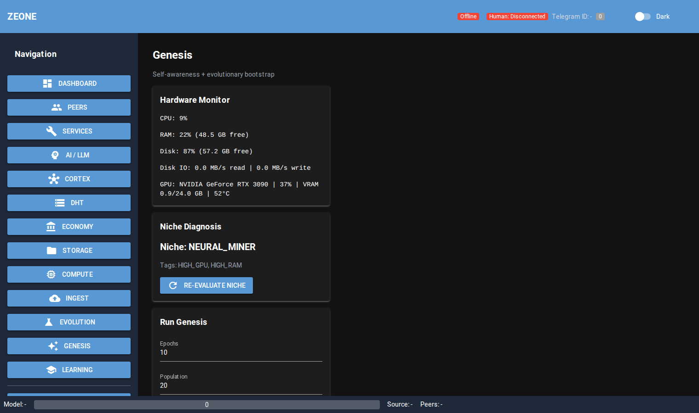
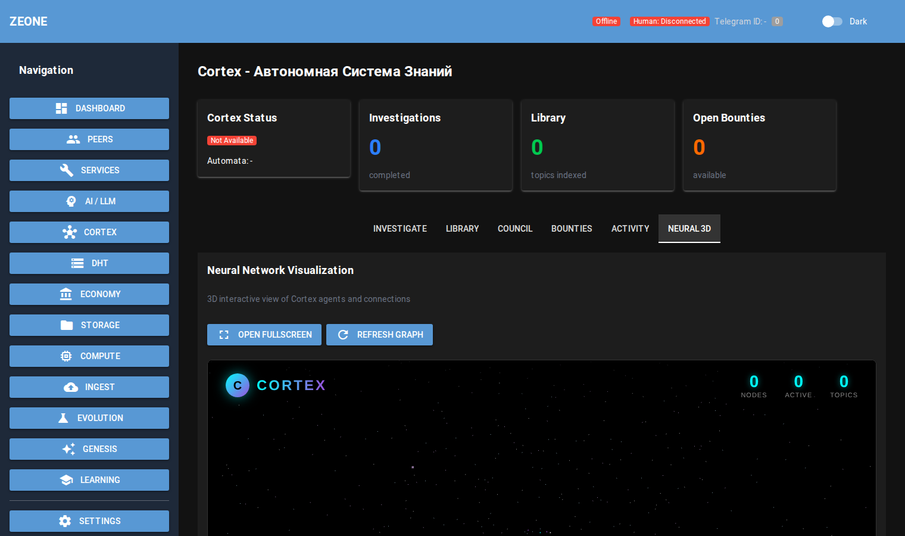
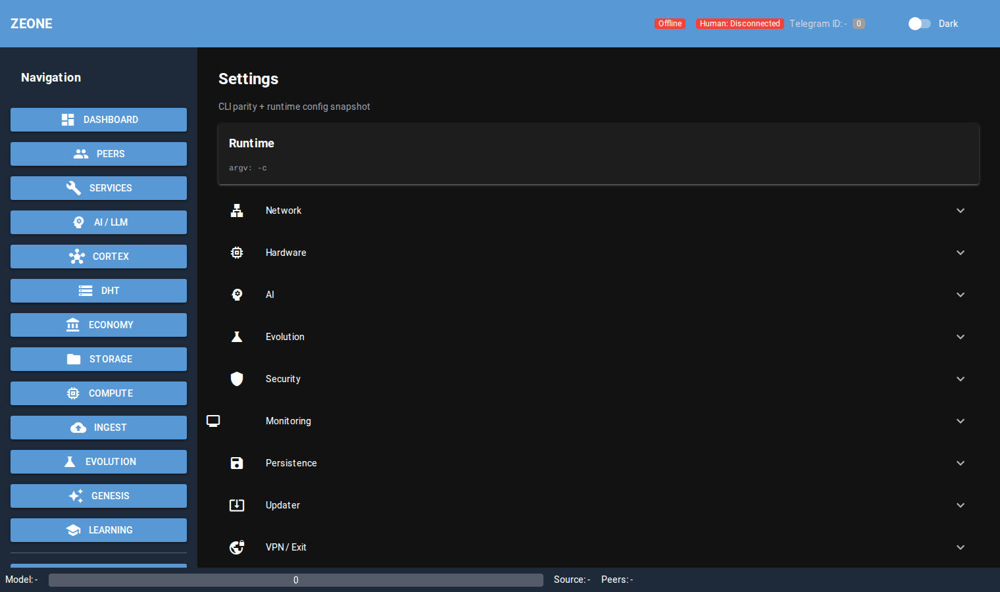

[🇷🇺 Читать на русском](README_RU.md)

   

# ZEONE — decentralized operating system for the cognitive internet

ZEONE unifies compute, traffic, and economics into a peer-to-peer stack—from NaCl transport to local LLMs and P2P caching for video.

## Features
- 🧠 **Cortex:** Local LLM + RAG + Vision (Florence-2) pipeline.
- 🛡️ **VPN Tunnel:** Decentralized SOCKS5 with `VpnExitAgent` and smart Pathfinder (speed/price/reliable).
- 🚀 **Amplifier:** P2P CDN with `CACHE_REQUEST` / `CACHE_RESPONSE` chunk sharing and caching for video/files.
- 💎 **Tokenomics:** Ledger IOU + ERC-20 settlement, Trust Score, billing hooks for bandwidth and services.

## Quick Start (Docker)
```bash
docker-compose up
```

WebUI defaults to `http://localhost:8080`.

## Interface

**Genesis**



**Network Graph**



**Settings**



## Manual Run (Python 3.11)
```bash
python -m venv .venv && source .venv/bin/activate
pip install -r requirements.txt
python main.py --port 8468 --webui --webui-port 8080
```

Default bootstrap: `boot.ze1.org:80` (override with `--bootstrap`).

Connect a second node:
```bash
python main.py --port 8469 --bootstrap 127.0.0.1:8468 --webui --webui-port 8081
```

## VPN / SOCKS5 (CLI)

Exit node (advertise public IP):
```bash
python main.py --exit-node --public-ip 1.2.3.4
```

Client (local SOCKS5 on 127.0.0.1:9999):
```bash
python main.py --vpn-client --socks-port 9999 --vpn-region US
curl --socks5-hostname 127.0.0.1:9999 https://ifconfig.me
```

## MCP (SSE)

```bash
python main.py --mcp --mcp-port 8090
```

Endpoints:
- `http://localhost:8090/mcp/sse`
- `http://localhost:8090/mcp/messages`

## Documentation
- Build docs: `python build_docs.py`
- HTML entry: `docs/build/html/index.html`

## License
MIT
