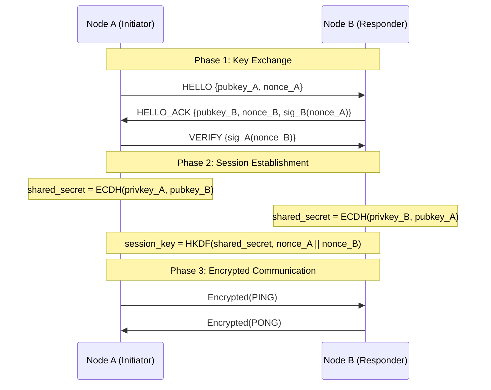
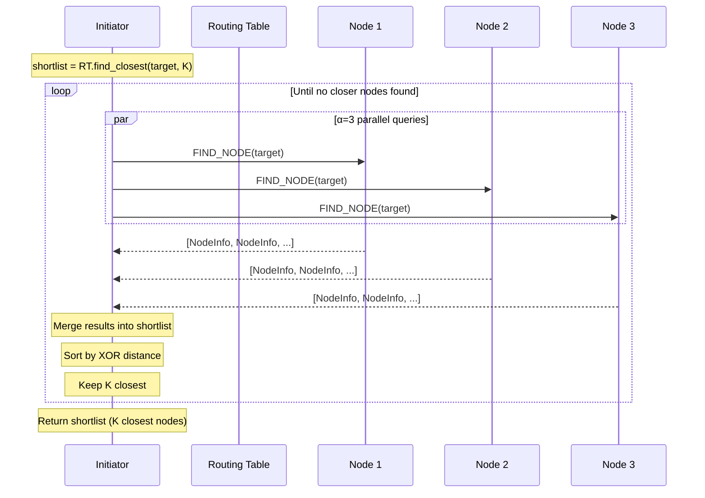
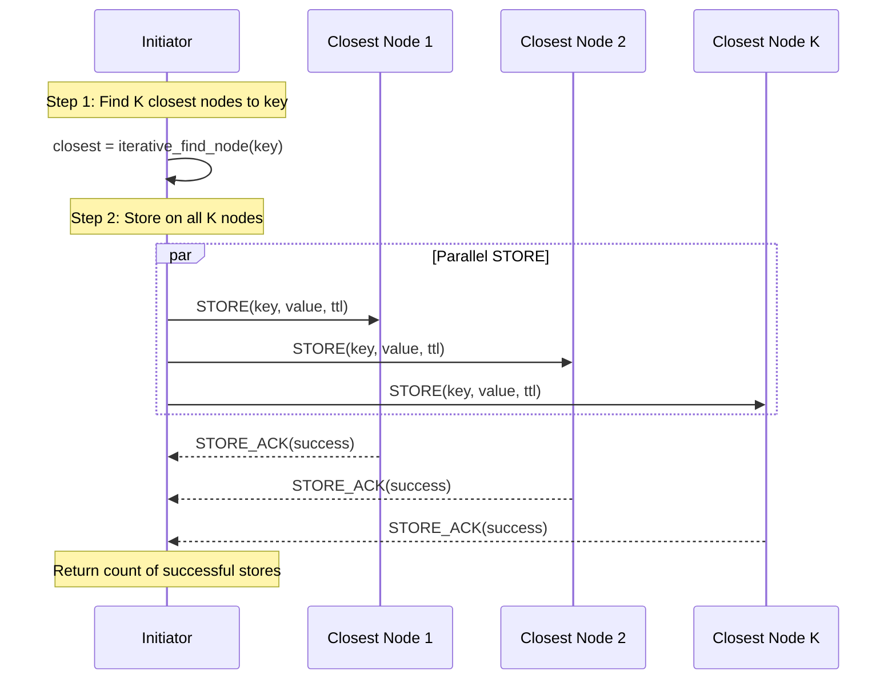
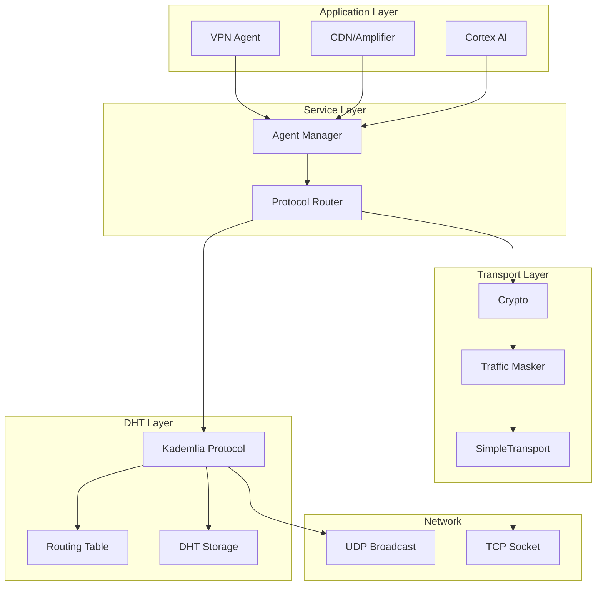

# ZEONE Core Architecture

## Overview

The ZEONE core consists of three main layers:
1. **Transport Layer** — encryption, signatures, wire protocol
2. **DHT Layer** — Kademlia for routing and storage
3. **Service Layer** — message handlers and RPC

---

## 1. Wire Protocol

### 1.1 Legacy JSON Protocol [DEPRECATED]

**[WARNING]** This protocol is DEPRECATED since version 2.0. Use Binary Wire Protocol (section 1.2).

Legacy `SimpleTransport` used a simple format:

```
┌─────────────────┬──────────────────────────────────┐
│ Length (4 bytes)│ JSON Payload (variable)          │
│ big-endian      │ UTF-8 encoded Message            │
└─────────────────┴──────────────────────────────────┘
```

**Message Structure (JSON):**
```json
{
  "type": "PING",
  "payload": {},
  "sender_id": "base64(Ed25519_pubkey)",
  "timestamp": 1701234567.89,
  "signature": "base64(Ed25519_sig)",
  "nonce": "base64(random_16_bytes)"
}
```

**Drawbacks:**
- JSON overhead: ~40% size on service data
- No protocol versioning
- Missing magic number for stream identification

### 1.2 Binary Wire Protocol v1 [CURRENT]

**[IMPLEMENTED]** Fully implemented in [`core/wire.py`](../../core/wire.py).

Binary format for production with strict security requirements:

```
 0                   1                   2                   3
 0 1 2 3 4 5 6 7 8 9 0 1 2 3 4 5 6 7 8 9 0 1 2 3 4 5 6 7 8 9 0 1
├─┴─┴─┴─┴─┴─┴─┴─┴─┴─┴─┴─┴─┴─┴─┴─┴─┴─┴─┴─┴─┴─┴─┴─┴─┴─┴─┴─┴─┴─┴─┴─┤
│         Magic (0x5A45)        │    Version    │     Type      │
├───────────────────────────────┴───────────────┴───────────────┤
│                        Length (32-bit)                        │
├───────────────────────────────────────────────────────────────┤
│                                                               │
│                        Nonce (24 bytes)                       │
│                                                               │
├───────────────────────────────────────────────────────────────┤
│                                                               │
│                      Signature (64 bytes)                     │
│                                                               │
├───────────────────────────────────────────────────────────────┤
│                                                               │
│                    Encrypted Payload (...)                    │
│                                                               │
└───────────────────────────────────────────────────────────────┘
```

**Fields:**

| Field | Size | Description |
|-------|------|-------------|
| Magic | 2 bytes | `0x5A45` ("ZE" in ASCII) — protocol identifier |
| Version | 1 byte | Protocol version (current: 0x01) |
| Type | 1 byte | Message type (enum MessageType) |
| Length | 4 bytes | Payload size in bytes (big-endian) |
| Nonce | 24 bytes | XSalsa20 nonce for encryption |
| Signature | 64 bytes | Ed25519 signature (type + length + nonce + payload) |
| Payload | variable | XSalsa20-Poly1305 encrypted payload |

**Message Types (1 byte):**

| Value | Type | Direction |
|-------|------|-----------|
| 0x01 | PING | Request |
| 0x02 | PONG | Response |
| 0x03 | DISCOVER | Request |
| 0x04 | PEER_LIST | Response |
| 0x10 | DHT_FIND_NODE | Request |
| 0x11 | DHT_FIND_NODE_RESP | Response |
| 0x12 | DHT_FIND_VALUE | Request |
| 0x13 | DHT_FIND_VALUE_RESP | Response |
| 0x14 | DHT_STORE | Request |
| 0x15 | DHT_STORE_RESP | Response |
| 0x20 | SERVICE_REQUEST | Request |
| 0x21 | SERVICE_RESPONSE | Response |
| 0x30 | VPN_CONNECT | Request |
| 0x31 | VPN_DATA | Bidirectional |
| 0x32 | VPN_CLOSE | Notification |
| 0x40 | CACHE_REQUEST | Request |
| 0x41 | CACHE_RESPONSE | Response |
| 0x50 | IOU | Bidirectional |
| 0x51 | BALANCE_CLAIM | Request |
| 0x52 | BALANCE_ACK | Response |

### 1.2.1 Hard Fork Notice

**[BREAKING CHANGE]** Binary Wire Protocol implements a Hard Fork:

- **Magic Bytes Check:** Any data without Magic `b'ZE'` (0x5A45) → immediate socket closure
- **No Backward Compatibility:** No backward compatibility with JSON protocol
- **Version Validation:** Incompatible protocol versions are rejected instantly

This prevents attacks via traffic forgery and ensures protocol purity at transport level.

**Code:** [`core/wire.py:585-645`](../../core/wire.py) - `handle_incoming_connection()` with Magic check

### 1.3 Handshake Protocol

Establishing a secure connection between nodes:



**Cryptographic Primitives:**

| Operation | Algorithm | Library |
|-----------|-----------|---------|
| Signatures | Ed25519 | PyNaCl SigningKey |
| Key Exchange | X25519 (Curve25519 ECDH) | PyNaCl Box |
| Encryption | XSalsa20-Poly1305 | PyNaCl SecretBox |
| KDF | HKDF-SHA256 | — |

**Session key generation code:**
```python
from nacl.public import PrivateKey, PublicKey, Box
from nacl.hash import blake2b

# ECDH
box = Box(my_private_key, peer_public_key)
shared_secret = box.shared_key()

# KDF
session_key = blake2b(
    shared_secret + nonce_a + nonce_b,
    digest_size=32,
    key=b"ZEONE_SESSION_KEY_V1"
)
```

---

## 2. Kademlia DHT

### 2.1 Parameters

| Parameter | Value | Description |
|-----------|-------|-------------|
| K | 20 | K-bucket size (nodes per bucket) |
| α (ALPHA) | 3 | Lookup query parallelism |
| ID_BITS | 160 | Identifier bit length (SHA-1) |
| BUCKET_REFRESH_INTERVAL | 3600s | Bucket refresh interval |
| DEFAULT_TTL | 86400s | Record lifetime (24 hours) |
| REPUBLISH_INTERVAL | 3600s | Republication interval (1 hour) |
| RPC_TIMEOUT | 5s | RPC request timeout |

### 2.2 XOR Distance Metric

Distance between two 160-bit IDs:

$$
d(a, b) = a \oplus b
$$

interpreted as an unsigned integer.

**Implementation:**
```python
def xor_distance(id1: bytes, id2: bytes) -> int:
    """
    XOR distance between two 20-byte node IDs.
    
    Returns:
        Integer distance (0 to 2^160 - 1)
    """
    xor_bytes = bytes(a ^ b for a, b in zip(id1, id2))
    return int.from_bytes(xor_bytes, byteorder='big')
```

**XOR Metric Properties:**
1. \( d(a, a) = 0 \) — reflexivity
2. \( d(a, b) = d(b, a) \) — symmetry
3. \( d(a, b) + d(b, c) \geq d(a, c) \) — triangle inequality
4. Unary: for any \( a, b \) there exists unique \( c \): \( d(a, c) = b \)

### 2.3 Routing Table Structure

160 k-buckets, where bucket \( i \) contains nodes with distance \( 2^i \leq d < 2^{i+1} \):

```
Bucket[0]:   distance ∈ [1, 2)        — 1 bit differs
Bucket[1]:   distance ∈ [2, 4)        — 2 bits
Bucket[2]:   distance ∈ [4, 8)        — 3 bits
...
Bucket[159]: distance ∈ [2^159, 2^160) — all bits differ
```

**Bucket index by distance:**
```python
def distance_to_bucket_index(distance: int) -> int:
    if distance == 0:
        return 0
    return distance.bit_length() - 1
```

**K-bucket LRU policy:**
1. If node already in bucket → move to end (most recently seen)
2. If bucket not full → add to end
3. If bucket full:
   - PING oldest node (head)
   - If responds → discard new node
   - If doesn't respond → replace with new

### 2.4 Iterative FIND_NODE

Finding K closest nodes to target ID:



**Pseudocode:**
```python
async def iterative_find_node(target_id: bytes) -> List[NodeInfo]:
    shortlist = routing_table.find_closest(target_id, K)
    queried = set()
    
    while True:
        # Select α unqueried nodes
        to_query = [n for n in shortlist if n.id not in queried][:ALPHA]
        if not to_query:
            break
        
        # Parallel queries
        for node in to_query:
            queried.add(node.id)
        
        responses = await asyncio.gather(*[
            send_find_node(node, target_id) for node in to_query
        ], return_exceptions=True)
        
        # Merge results
        found_closer = False
        for response in responses:
            if isinstance(response, Exception):
                continue
            for new_node in response.nodes:
                if new_node.id not in [n.id for n in shortlist]:
                    shortlist.append(new_node)
                    found_closer = True
        
        # Sort and truncate
        shortlist.sort(key=lambda n: xor_distance(target_id, n.id))
        shortlist = shortlist[:K]
        
        if not found_closer:
            break
    
    return shortlist
```

### 2.5 Iterative STORE

Storing key-value pairs in DHT:



### 2.6 Republication

Mechanism for maintaining data in the network:

1. **Original Publisher Republication:**
   - Every `REPUBLISH_INTERVAL` (1 hour) data owner performs STORE
   - Updates `timestamp` and `last_republish`

2. **Replica Republication:**
   - Nodes storing replicas also republish
   - Prevents loss when original publisher leaves

3. **Expiration:**
   - Records with `timestamp + ttl < now` are deleted during `cleanup()`
   - `CLEANUP_INTERVAL = 300s` (5 minutes)

---

## 3. Storage Layer

### 3.1 DHTStorage Schema

SQLite table `dht_store`:

```sql
CREATE TABLE dht_store (
    key BLOB PRIMARY KEY,          -- 20 bytes (SHA-1)
    value BLOB NOT NULL,           -- up to 64KB
    publisher_id BLOB NOT NULL,    -- 20 bytes
    timestamp REAL NOT NULL,       -- UNIX timestamp
    ttl INTEGER NOT NULL,          -- seconds
    last_republish REAL            -- UNIX timestamp
);

CREATE INDEX idx_dht_expires ON dht_store(timestamp, ttl);
CREATE INDEX idx_dht_republish ON dht_store(last_republish);
```

### 3.2 Limits

| Parameter | Value |
|-----------|-------|
| MAX_VALUE_SIZE | 65536 bytes (64 KB) |
| Key length | 20 bytes (SHA-1) |
| DEFAULT_TTL | 86400 seconds (24 hours) |

### 3.3 Key Derivation

```python
def string_to_key(s: str) -> bytes:
    """Convert string to 20-byte DHT key."""
    return hashlib.sha1(s.encode('utf-8')).digest()

def bytes_to_key(data: bytes) -> bytes:
    """Convert bytes to 20-byte DHT key."""
    return hashlib.sha1(data).digest()
```

**Key Examples:**
- Service: `service:vpn_exit` → `sha1("service:vpn_exit")`
- Cache: `cache:<sha256_hash>` → `sha1("cache:" + hash)`
- Model: `model:<model_id>` → `sha1("model:" + id)`

---

## 4. Message Handlers

### 4.1 Protocol Router

Routing incoming messages:

```python
class ProtocolRouter:
    handlers: Dict[MessageType, MessageHandler]
    
    async def route(self, message: Message, context: Dict) -> Optional[Message]:
        handler = self.handlers.get(message.type)
        if not handler:
            return None
        return await handler.handle(message, crypto, context)
```

### 4.2 Ping-Pong Handler

**Replay attack protection:**
```python
MAX_PING_AGE = 60.0  # seconds

async def handle_ping(message: Message) -> Optional[Message]:
    # 1. Verify signature
    if not crypto.verify_signature(message):
        return None  # Silent drop
    
    # 2. Check timestamp
    age = time.time() - message.timestamp
    if age > MAX_PING_AGE:
        return None  # Possible replay
    
    # 3. Create signed PONG
    pong = Message(
        type=MessageType.PONG,
        payload={
            "original_nonce": message.nonce,
            "ping_timestamp": message.timestamp,
        },
        sender_id=crypto.node_id,
    )
    return crypto.sign_message(pong)
```

### 4.3 Service Request Handler

Processing service requests with economics:

```python
async def handle_service_request(message: Message) -> Message:
    # 1. Verify signature
    if not crypto.verify_signature(message):
        return error_response("Invalid signature")
    
    # 2. Extract request
    service_name = message.payload["service_name"]
    budget = message.payload["budget"]
    
    # 3. Execute via AgentManager
    response = await agent_manager.handle_request(
        ServiceRequest(
            service_name=service_name,
            payload=message.payload["payload"],
            requester_id=message.sender_id,
            budget=budget,
        )
    )
    
    # 4. Cost recorded in Ledger automatically
    return Message(
        type=MessageType.SERVICE_RESPONSE,
        payload=response.to_dict(),
        sender_id=crypto.node_id,
    )
```

---

## 5. Traffic Masking

### 5.1 HTTP Masking

Traffic masking as HTTP for DPI bypass:

```python
HTTP_REQUEST_TEMPLATE = """
POST /api/v1/sync HTTP/1.1
Host: {host}
Content-Type: application/json
User-Agent: Mozilla/5.0 (Windows NT 10.0; Win64; x64)
Content-Length: {length}
Connection: keep-alive

{payload}
"""

def mask_as_http(message: Message) -> bytes:
    payload = message.to_json()
    encoded = base64.b64encode(payload.encode()).decode()
    body = json.dumps({"data": encoded, "v": "1.0"})
    return HTTP_REQUEST_TEMPLATE.format(
        host="api.example.com",
        length=len(body),
        payload=body,
    ).encode()
```

### 5.2 Detection

```python
def is_http_masked(data: bytes) -> bool:
    try:
        text = data.decode('utf-8')
        return (
            text.startswith("POST /api/") or 
            text.startswith("HTTP/1.")
        )
    except UnicodeDecodeError:
        return False
```

---

## Full Stack Diagram



---

## References

1. Maymounkov, P., Mazières, D. — Kademlia: A Peer-to-peer Information System Based on the XOR Metric (IPTPS 2002)
2. Bernstein, D.J. — The Salsa20 family of stream ciphers
3. Bernstein, D.J. et al. — Ed25519: high-speed high-security signatures
4. RFC 7748 — Elliptic Curves for Security (X25519)
