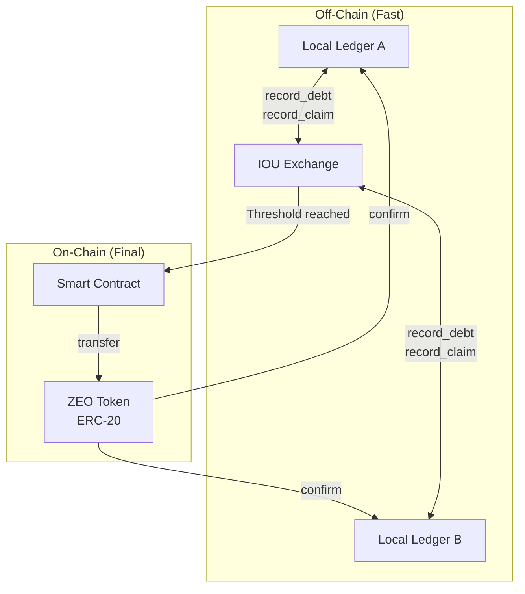
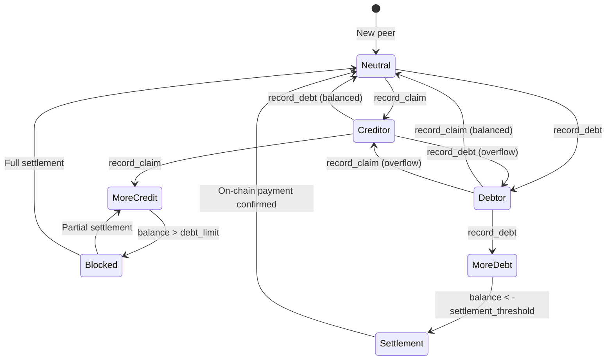
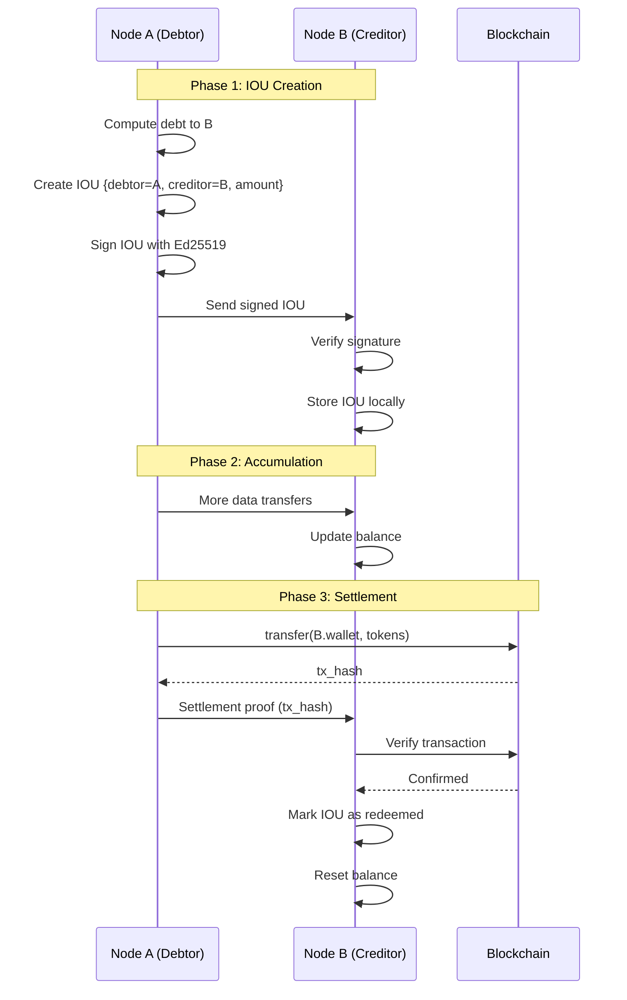
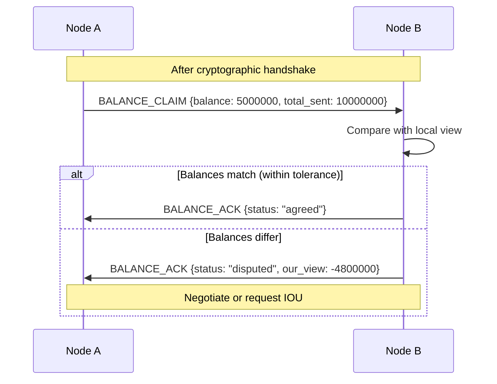
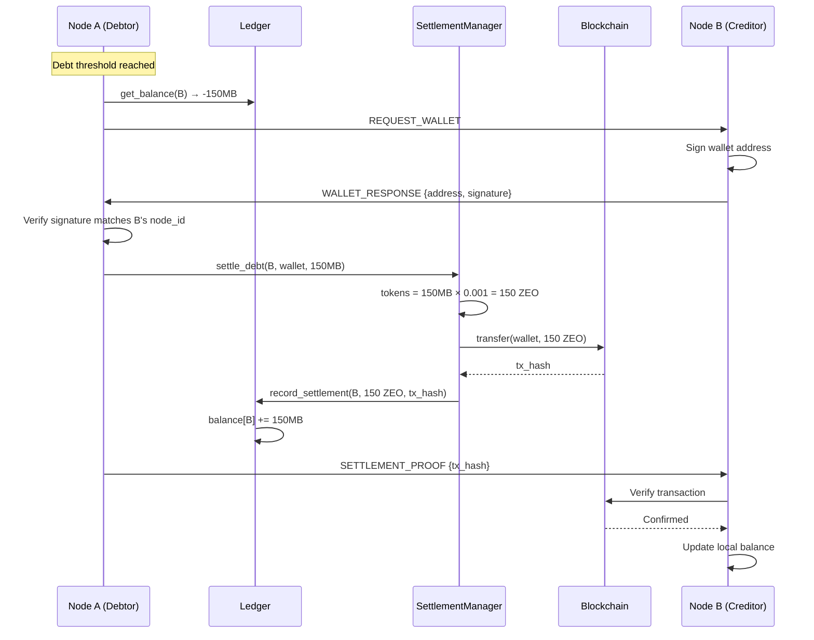

# Economy & Settlement

## Overview

ZEONE's economic system implements a two-tier settlement model:
1. **Off-chain (Ledger)** — instant micropayments via IOU
2. **On-chain (Settlement)** — periodic settlement via ERC-20 token

---

## 1. Double Ledger System

### 1.1 Concept



### 1.2 Balance Semantics

Each node maintains a local balance with each peer:

```
balance > 0  →  Peer owes us (we distributed more)
balance < 0  →  We owe peer (we consumed more)
balance = 0  →  Balance settled
```

#### Note: accounting units (current implementation)

- The ledger stores **credit units**. Transport uses bytes, services use service cost, VPN uses price per MB.
- `debt_limit` applies across all debts, so **units are mixed**.
- On‑chain settlement uses **SIBR**, but IOU → SIBR mapping is not unified yet.
- Expect occasional `balance mismatch` logs due to unit mismatch and asymmetric accounting.

### 1.3 Database Schema

SQLite table `balances`:

```sql
CREATE TABLE balances (
    peer_id TEXT PRIMARY KEY,
    balance REAL DEFAULT 0,        -- Current balance in bytes
    total_sent REAL DEFAULT 0,     -- Cumulative sent
    total_received REAL DEFAULT 0, -- Cumulative received
    last_updated REAL,             -- UNIX timestamp
    FOREIGN KEY (peer_id) REFERENCES peers(node_id)
);
```

SQLite table `transactions`:

```sql
CREATE TABLE transactions (
    id TEXT PRIMARY KEY,           -- SHA-256 hash
    from_id TEXT NOT NULL,
    to_id TEXT NOT NULL,
    amount REAL NOT NULL,          -- Bytes
    timestamp REAL NOT NULL,
    signature TEXT NOT NULL,       -- Ed25519 signature
    tx_type TEXT DEFAULT 'transfer', -- debt|claim|settlement
    metadata TEXT,                 -- JSON
    FOREIGN KEY (from_id) REFERENCES peers(node_id),
    FOREIGN KEY (to_id) REFERENCES peers(node_id)
);

CREATE INDEX idx_tx_from ON transactions(from_id);
CREATE INDEX idx_tx_to ON transactions(to_id);
CREATE INDEX idx_tx_type ON transactions(tx_type);
```

---

## 2. Balance Operations

### 2.1 record_debt

Called when **receiving** data from peer:

```python
async def record_debt(
    self,
    peer_id: str,
    amount: float,      # bytes received
    signature: str = "",
) -> float:
    """
    Record that we owe peer (consumption).
    
    Called when RECEIVING data from peer.
    Decreases our balance (makes it more negative).
    
    Returns:
        New balance with this peer
    """
    async with self._lock:
        cursor = await self._db.execute(
            "SELECT balance, total_received FROM balances WHERE peer_id = ?",
            (peer_id,)
        )
        row = await cursor.fetchone()
        
        if row:
            new_balance = row[0] - amount  # Decrease (we owe more)
            new_received = row[1] + amount
            await self._db.execute(
                """UPDATE balances 
                   SET balance = ?, total_received = ?, last_updated = ?
                   WHERE peer_id = ?""",
                (new_balance, new_received, time.time(), peer_id)
            )
        else:
            new_balance = -amount  # Start negative
            await self._db.execute(
                """INSERT INTO balances 
                   (peer_id, balance, total_sent, total_received, last_updated)
                   VALUES (?, ?, 0, ?, ?)""",
                (peer_id, new_balance, amount, time.time())
            )
        
        # Record transaction
        tx_id = sha256(f"debt:{peer_id}:{amount}:{time.time()}")
        await self._db.execute(
            """INSERT OR IGNORE INTO transactions 
               (id, from_id, to_id, amount, timestamp, signature, tx_type)
               VALUES (?, ?, ?, ?, ?, ?, ?)""",
            (tx_id, peer_id, "self", amount, time.time(), signature, "debt")
        )
        
        await self._db.commit()
        self._balance_cache[peer_id] = new_balance
        
        return new_balance
```

### 2.2 record_claim

Called when **sending** data to peer:

```python
async def record_claim(
    self,
    peer_id: str,
    amount: float,      # bytes sent
    signature: str = "",
) -> float:
    """
    Record that peer owes us (distribution).
    
    Called when SENDING data to peer.
    Increases our balance (peer owes us more).
    
    Returns:
        New balance with this peer
    """
    async with self._lock:
        cursor = await self._db.execute(
            "SELECT balance, total_sent FROM balances WHERE peer_id = ?",
            (peer_id,)
        )
        row = await cursor.fetchone()
        
        if row:
            new_balance = row[0] + amount  # Increase (they owe more)
            new_sent = row[1] + amount
            await self._db.execute(
                """UPDATE balances 
                   SET balance = ?, total_sent = ?, last_updated = ?
                   WHERE peer_id = ?""",
                (new_balance, new_sent, time.time(), peer_id)
            )
        else:
            new_balance = amount  # Start positive
            await self._db.execute(
                """INSERT INTO balances 
                   (peer_id, balance, total_sent, total_received, last_updated)
                   VALUES (?, ?, ?, 0, ?)""",
                (peer_id, new_balance, amount, time.time())
            )
        
        # Record transaction
        tx_id = sha256(f"claim:{peer_id}:{amount}:{time.time()}")
        await self._db.execute(
            """INSERT OR IGNORE INTO transactions 
               (id, from_id, to_id, amount, timestamp, signature, tx_type)
               VALUES (?, ?, ?, ?, ?, ?, ?)""",
            (tx_id, "self", peer_id, amount, time.time(), signature, "claim")
        )
        
        await self._db.commit()
        self._balance_cache[peer_id] = new_balance
        
        return new_balance
```

### 2.3 Blocking Mechanism

Protection against leechers via send blocking:

```python
# Default: 100 MB
DEFAULT_DEBT_LIMIT_BYTES = 100 * 1024 * 1024

def is_peer_blocked(self, peer_id: str) -> bool:
    """
    Check if peer is blocked due to excessive debt.
    
    BLOCKING LOGIC:
    If balance > debt_limit, peer owes us too much.
    We stop sending data until they repay.
    
    Returns:
        True if peer should be blocked
    """
    balance = self._balance_cache.get(peer_id, 0.0)
    return balance > self.debt_limit

async def check_can_send(self, peer_id: str) -> Tuple[bool, str]:
    """
    Pre-flight check before sending data.
    
    Returns:
        (can_send, reason)
    """
    balance = await self.get_balance(peer_id)
    
    if balance > self.debt_limit:
        return (
            False,
            f"Peer debt exceeds limit: {balance:.0f} > {self.debt_limit} bytes"
        )
    
    return (True, "OK")
```

---

## 3. State Diagram



---

## 4. IOU (I Owe You)

### 4.1 Structure

```python
@dataclass
class IOU:
    id: str              # SHA-256 hash of content
    debtor_id: str       # Who owes (creator of IOU)
    creditor_id: str     # Who is owed
    amount: float        # Debt amount
    created_at: float    # UNIX timestamp
    expires_at: float    # Expiration (optional)
    signature: str       # Ed25519 signature by debtor
    redeemed: bool       # Has been settled
    redeemed_at: float   # When settled
```

### 4.2 IOU Lifecycle



### 4.3 IOU Database Schema

```sql
CREATE TABLE ious (
    id TEXT PRIMARY KEY,
    debtor_id TEXT NOT NULL,
    creditor_id TEXT NOT NULL,
    amount REAL NOT NULL,
    created_at REAL NOT NULL,
    expires_at REAL,               -- NULL = no expiration
    signature TEXT NOT NULL,
    redeemed INTEGER DEFAULT 0,
    redeemed_at REAL,
    FOREIGN KEY (debtor_id) REFERENCES peers(node_id),
    FOREIGN KEY (creditor_id) REFERENCES peers(node_id)
);

CREATE INDEX idx_iou_debtor ON ious(debtor_id);
CREATE INDEX idx_iou_creditor ON ious(creditor_id);
```

### 4.4 IOU Signing

```python
def get_signing_data(self) -> bytes:
    """Data to sign (excludes id and signature)."""
    data = {
        "debtor_id": self.debtor_id,
        "creditor_id": self.creditor_id,
        "amount": self.amount,
        "created_at": self.created_at,
        "expires_at": self.expires_at,
    }
    return json.dumps(data, sort_keys=True, separators=(",", ":")).encode()

def create_signed_iou(
    crypto: Crypto,
    creditor_id: str,
    amount: float,
    expires_at: Optional[float] = None,
) -> IOU:
    """Create and sign IOU as debtor."""
    iou = IOU(
        id="",
        debtor_id=crypto.node_id,
        creditor_id=creditor_id,
        amount=amount,
        created_at=time.time(),
        expires_at=expires_at,
        signature="",
    )
    
    signing_data = iou.get_signing_data()
    iou.id = hashlib.sha256(signing_data).hexdigest()
    
    signed = crypto.signing_key.sign(signing_data)
    iou.signature = base64.b64encode(signed.signature).decode()
    
    return iou
```

---

## 5. Handshake Balance Exchange

### 5.1 Protocol

When establishing a connection, nodes exchange balance information:



### 5.2 Reconciliation Logic

```python
async def reconcile_balance(
    self,
    peer_id: str,
    peer_claimed_balance: float,  # What peer says we owe
    our_balance: Optional[float] = None,
) -> Dict[str, Any]:
    """
    Reconcile balance view with peer.
    
    Args:
        peer_id: Peer's node ID
        peer_claimed_balance: Balance from peer's perspective
        our_balance: Our local balance (if None, fetch from DB)
    
    Returns:
        Reconciliation result with status and action
    """
    if our_balance is None:
        our_balance = await self.get_balance(peer_id)
    
    # Peer sees balance inverted (our + is their -)
    peer_view = -peer_claimed_balance
    
    difference = abs(our_balance - peer_view)
    
    # Tolerance: 10% or 1MB, whichever is larger
    tolerance = max(abs(our_balance) * 0.1, 1024 * 1024)
    
    if difference <= tolerance:
        return {
            "status": "agreed",
            "our_balance": our_balance,
            "peer_claimed": peer_claimed_balance,
            "difference": difference,
        }
    else:
        return {
            "status": "disputed",
            "our_balance": our_balance,
            "peer_claimed": peer_claimed_balance,
            "difference": difference,
            "action": "request_iou" if our_balance > peer_view else "provide_iou",
        }
```

### 5.3 Message Types

```python
class MessageType(Enum):
    # ... other types ...
    
    BALANCE_CLAIM = auto()  # "Here's what I think you owe me"
    BALANCE_ACK = auto()    # "I agree" or "I dispute"
```

**BALANCE_CLAIM payload:**
```json
{
  "claimed_balance": 5000000,
  "total_sent": 10000000,
  "total_received": 5000000,
  "timestamp": 1701234567.89
}
```

**BALANCE_ACK payload:**
```json
{
  "status": "agreed|disputed",
  "our_view": -4800000,
  "action": "request_iou|provide_iou|none"
}
```

---

## 6. On-Chain Settlement

### 6.1 SiberiumManager (Native SIBR Token)

Interface to Siberium blockchain with native SIBR token:

**[KEY DIFFERENCE]** SIBR is the native gas token (like ETH on Ethereum). No ERC-20 contract - uses native transfers via `web3.eth.send_transaction`.

```python
class SiberiumManager:
    def __init__(
        self,
        rpc_url: str = None,           # https://rpc.siberium.net (mainnet) or https://rpc.test.siberium.net (testnet)
        private_key: str = None,       # Wallet private key
        settlement_address: str = None, # ZEOSettlement.sol contract address
        network: SiberiumNetwork = None,
    ):
        self.rpc_url = rpc_url or os.getenv("SIBERIUM_RPC_URL", SIBERIUM_TESTNET.rpc_url)
        self.w3 = Web3(Web3.HTTPProvider(self.rpc_url))
        self.w3.middleware_onion.inject(geth_poa_middleware, layer=0)
        
        self.account = Account.from_key(private_key)
        self.address = self.account.address
        
        # Native balance operations
        balance_wei = self.w3.eth.get_balance(address)
        balance_sibr = Decimal(balance_wei) / Decimal(10**18)
        
        # Settlement contract (for staking and claims)
        if settlement_address:
            self.settlement = self.w3.eth.contract(
                address=Web3.to_checksum_address(settlement_address),
                abi=SETTLEMENT_ABI,
            )
```

**Code:** [`economy/chain.py`](economy/chain.py) - SiberiumManager

### 6.2 Native SIBR Operations

#### Get Balance

```python
def get_balance(self, address: Optional[str] = None) -> Decimal:
    """
    Get native SIBR balance.
    
    Args:
        address: Address to check (default: own address)
    
    Returns:
        Balance in SIBR (not wei)
    """
    address = address or self.address
    address = Web3.to_checksum_address(address)
    wei = self.w3.eth.get_balance(address)
    return Decimal(wei) / Decimal(10**18)
```

#### Native Transfer

```python
async def transfer(
    self,
    to_address: str,
    amount: Decimal,
    gas_price: Optional[int] = None,
) -> str:
    """
    Transfer native SIBR tokens.
    
    Args:
        to_address: Recipient address
        amount: Amount in SIBR (not wei)
        gas_price: Custom gas price (default: network gas price)
    
    Returns:
        Transaction hash
    """
    to_address = Web3.to_checksum_address(to_address)
    amount_wei = int(amount * Decimal(10**18))
    
    # Build transaction
    tx = {
        "from": self.address,
        "to": to_address,
        "value": amount_wei,
        "nonce": self.w3.eth.get_transaction_count(self.address),
        "gas": 21000,  # Standard transfer gas
        "gasPrice": gas_price or self.w3.eth.gas_price,
        "chainId": self.network.chain_id,
    }
    
    # Sign and send
    signed = self.account.sign_transaction(tx)
    tx_hash = self.w3.eth.send_raw_transaction(signed.rawTransaction)
    
    return tx_hash.hex()
```

#### Settlement Contract Integration

ZEOSettlement.sol allows:
- **Deposit (payable):** Stake native SIBR
- **Claim:** Claim settlement payment via signed IOU
- **Unstake flow:** request_unstake -> wait 7 days -> withdraw

**Code:** [`economy/chain.py:287-422`](economy/chain.py)

### 6.3 Settlement Contract Operations

#### Deposit Stake

```python
async def deposit_stake(self, amount: Decimal) -> str:
    """
    Deposit SIBR as stake in Settlement contract.
    
    Args:
        amount: Amount in SIBR
    
    Returns:
        Transaction hash
    """
    amount_wei = int(amount * Decimal(10**18))
    
    # Build deposit transaction (payable)
    tx = self.settlement.functions.deposit().build_transaction({
        "from": self.address,
        "value": amount_wei,
        "nonce": self.w3.eth.get_transaction_count(self.address),
        "gas": 100000,
        "gasPrice": self.w3.eth.gas_price,
        "chainId": self.network.chain_id,
    })
    
    signed = self.account.sign_transaction(tx)
    tx_hash = self.w3.eth.send_raw_transaction(signed.rawTransaction)
    
    return tx_hash.hex()
```

#### Claim Settlement

```python
async def claim_settlement(
    self,
    payer: str,
    amount: Decimal,
    nonce: int,
    deadline: int,
    signature: bytes,
) -> str:
    """
    Claim a settlement payment (as payee).
    
    Args:
        payer: Address of the debtor
        amount: Amount in SIBR
        nonce: Nonce from signature
        deadline: Signature deadline
        signature: EIP-712 signature from payer
    
    Returns:
        Transaction hash
    """
    payer = Web3.to_checksum_address(payer)
    amount_wei = int(amount * Decimal(10**18))
    
    tx = self.settlement.functions.claim(
        payer,
        amount_wei,
        nonce,
        deadline,
        signature,
    ).build_transaction({
        "from": self.address,
        "nonce": self.w3.eth.get_transaction_count(self.address),
        "gas": 150000,
        "gasPrice": self.w3.eth.gas_price,
        "chainId": self.network.chain_id,
    })
    
    signed = self.account.sign_transaction(tx)
    tx_hash = self.w3.eth.send_raw_transaction(signed.rawTransaction)
    
    return tx_hash.hex()
```

**Code:** [`economy/chain.py:287-532`](economy/chain.py)

def wait_for_receipt(
    self,
    tx_hash: str,
    confirmations: int = 12,
    timeout: int = 300,
) -> bool:
    """
    Wait for transaction confirmation.
    
    Args:
        tx_hash: Transaction hash
        confirmations: Required block confirmations
        timeout: Max wait time in seconds
    
    Returns:
        True if transaction succeeded
    """
    receipt = self.web3.eth.wait_for_transaction_receipt(tx_hash, timeout)
    start_block = receipt.blockNumber
    
    # Wait for confirmations
    while self.web3.eth.block_number - start_block < confirmations:
        time.sleep(1)
    
    return receipt.status == 1
```

### 6.4 SettlementManager

Coordination of off-chain and on-chain:

```python
class SettlementManager:
    def __init__(
        self,
        ledger: Ledger,
        chain: ChainManager,
        credit_rate: Decimal = Decimal("0.001"),  # tokens per byte
    ):
        self.ledger = ledger
        self.chain = chain
        self.credit_rate = credit_rate
    
    async def settle_debt(
        self,
        peer_id: str,
        peer_wallet: str,
        amount_credits: float,
    ) -> Optional[str]:
        """
        Convert credits to tokens and settle on-chain.
        
        Args:
            peer_id: Peer's node ID
            peer_wallet: Peer's wallet address (must be signed)
            amount_credits: Debt in credit units (bytes)
        
        Returns:
            Transaction hash or None on failure
        """
        tokens = Decimal(str(amount_credits)) * self.credit_rate
        
        try:
            tx_hash = await self.chain.transfer(peer_wallet, tokens)
            await self.ledger.record_settlement(peer_id, float(tokens), tx_hash)
            return tx_hash
        except Exception as e:
            logger.error(f"Settlement failed: {e}")
            return None
    
    @staticmethod
    def verify_signed_address(
        address: str,
        signature_b64: str,
        peer_node_id: str,
    ) -> bool:
        """
        Verify wallet address is signed by peer's Ed25519 key.
        
        Prevents sending tokens to wrong address.
        """
        verify_key = VerifyKey(peer_node_id.encode(), encoder=Base64Encoder)
        try:
            verify_key.verify(address.encode(), Base64Encoder.decode(signature_b64))
            return True
        except Exception:
            return False
```

### 6.5 Settlement Flow



### 6.6 Siberium Networks

ZEONE uses Siberium blockchain for on-chain settlement:

| Network | Chain ID | RPC URL | Explorer |
|---------|----------|---------|----------|
| Mainnet | 111111 | https://rpc.siberium.net | https://explorer.siberium.net |
| Testnet | 111000 | https://rpc.test.siberium.net | https://explorer.test.siberium.net |

**Features:**
- Native gas token: SIBR (18 decimals)
- EVM-compatible (uses Web3.py)
- PoA consensus with geth_poa_middleware
- Low gas fees for micropayments

**Example connection:**

```python
from economy.chain import SiberiumManager, SIBERIUM_MAINNET, SIBERIUM_TESTNET

# Testnet
manager = SiberiumManager(
    rpc_url="https://rpc.test.siberium.net",
    private_key=os.getenv("WALLET_PRIVATE_KEY"),
    settlement_address=os.getenv("SETTLEMENT_ADDRESS"),
)

# Check balance
balance = manager.get_balance()
print(f"Balance: {balance} SIBR")

# Native transfer
tx_hash = await manager.transfer("0x...", Decimal("10.5"))
```

**Code:** [`economy/chain.py:68-94`](economy/chain.py) - Network configurations

---

## 7. Trust Score Integration

### 7.1 Events Affecting Trust

| Event | Weight | Trigger |
|-------|--------|---------|
| `debt_repaid` | +0.02 | Settlement confirmed |
| `excessive_debt` | -0.03 | Balance exceeds limit |
| `iou_created` | +0.005 | New IOU signed |
| `iou_redeemed` | +0.02 | IOU settled |
| `iou_defaulted` | -0.1 | IOU expired without payment |

### 7.2 Trust-based Limits

```python
def get_debt_limit_for_peer(
    self,
    peer_id: str,
    base_limit: int = DEFAULT_DEBT_LIMIT_BYTES,
) -> int:
    """
    Calculate debt limit based on peer's trust score.
    
    Higher trust = higher limit (more credit extension).
    """
    trust = self._trust_cache.get(peer_id, 0.5)
    
    # Linear scaling: T=0 → 10%, T=1 → 200%
    multiplier = 0.1 + (trust * 1.9)
    
    return int(base_limit * multiplier)
```

---

## 8. Pricing Signals

### 8.1 VPN Exit Pricing

Exit nodes publish pricing in DHT:

```python
def publish_exit_metadata(self):
    """Publish VPN exit node metadata to DHT."""
    metadata = {
        "node_id": self.crypto.node_id,
        "country": self.config.vpn_exit_country,  # ISO 3166-1
        "price_per_mb": self.config.vpn_exit_price,  # ZEO per MB
        "bandwidth_mbps": self.measured_bandwidth,
        "uptime_percent": self.uptime_tracker.percent,
        "trust_score": self.local_trust,
    }
    
    key = f"service:vpn_exit:{self.crypto.node_id}"
    self.dht.store(key, json.dumps(metadata).encode())
```

### 8.2 Pathfinder Selection

```python
class PathfinderStrategy(Enum):
    FASTEST = "fastest"       # Lowest latency
    CHEAPEST = "cheapest"     # Lowest price
    RELIABLE = "reliable"     # Highest uptime + trust

def select_exit(
    self,
    exits: List[Dict],
    strategy: PathfinderStrategy,
) -> Optional[Dict]:
    """Select best exit node based on strategy."""
    
    if strategy == PathfinderStrategy.CHEAPEST:
        return min(exits, key=lambda e: e["price_per_mb"])
    
    elif strategy == PathfinderStrategy.FASTEST:
        # Measure RTT to each
        with_rtt = [(e, self.measure_rtt(e)) for e in exits]
        return min(with_rtt, key=lambda x: x[1])[0]
    
    elif strategy == PathfinderStrategy.RELIABLE:
        # Score = uptime × trust
        return max(exits, key=lambda e: e["uptime_percent"] * e["trust_score"])
```

---

## References

1. ERC-20: Token Standard — https://eips.ethereum.org/EIPS/eip-20
2. Web3.py Documentation — https://web3py.readthedocs.io/
3. Payment Channels — Lightning Network Whitepaper
4. Tit-for-Tat in BitTorrent — Cohen, B. "Incentives Build Robustness in BitTorrent"
