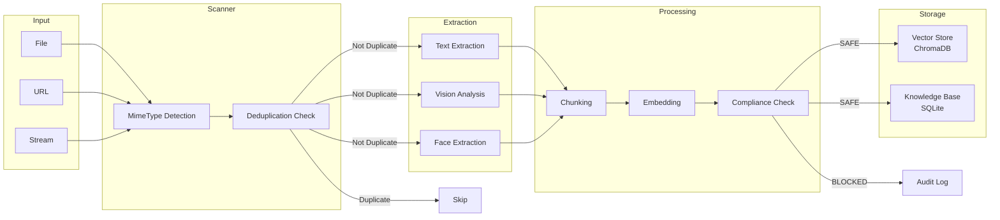
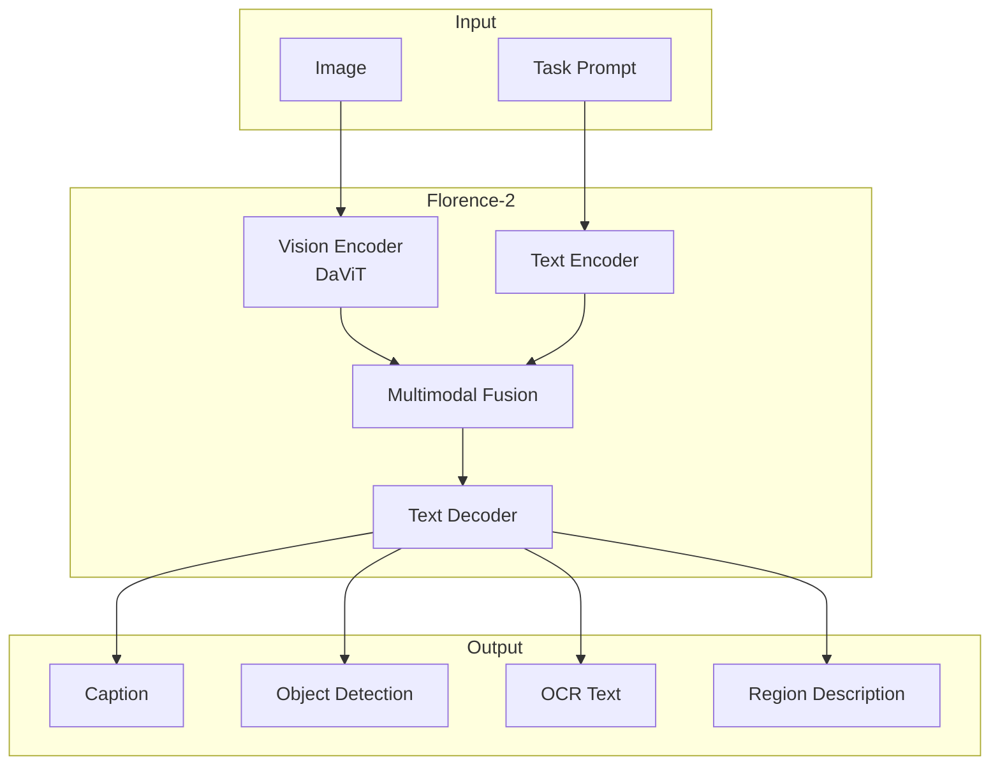
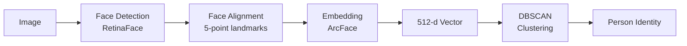
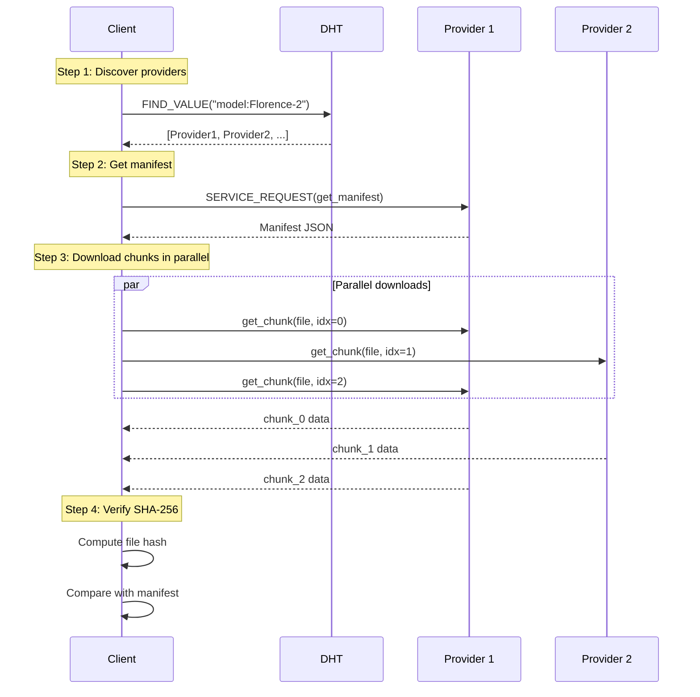
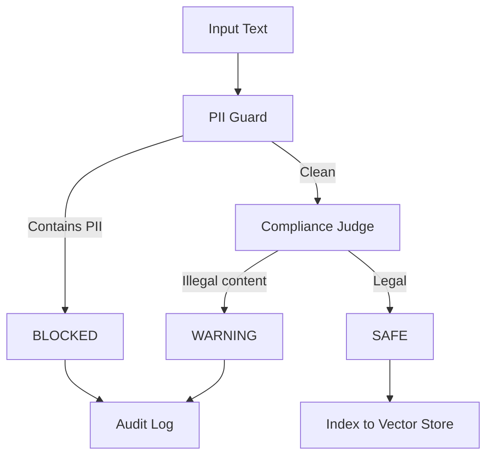

# Cortex: AI Pipeline

## Обзор

Cortex — когнитивный модуль ZEONE, реализующий:
- **Archivist** — индексация и семантический поиск документов
- **Vision** — анализ изображений (captioning, OCR, object detection)
- **Faces** — биометрия и кластеризация лиц
- **P2P Model Distribution** — распределённая загрузка ML-моделей

---

## 1. Ingestion Pipeline

### 1.1 Архитектура потока



### 1.2 MimeType Detection

Определение типа файла для выбора обработчика:

```python
SUPPORTED_TYPES = {
    # Text
    ".txt": "text/plain",
    ".md": "text/markdown",
    ".pdf": "application/pdf",
    ".docx": "application/vnd.openxmlformats-officedocument.wordprocessingml.document",
    
    # Images
    ".jpg": "image/jpeg",
    ".jpeg": "image/jpeg",
    ".png": "image/png",
    ".webp": "image/webp",
    
    # Video
    ".mp4": "video/mp4",
    ".mkv": "video/x-matroska",
}

def detect_mime(path: Path) -> str:
    ext = path.suffix.lower()
    return SUPPORTED_TYPES.get(ext, "application/octet-stream")
```

### 1.3 Deduplication (pHash)

Перцептуальный хэш для обнаружения дубликатов изображений:

```python
import imagehash
from PIL import Image

def phash_image(path: str, hash_size: int = 16) -> str:
    """
    Compute perceptual hash of image.
    
    Args:
        path: Path to image file
        hash_size: Hash size (default 16 = 256 bits)
    
    Returns:
        Hex string of perceptual hash
    """
    img = Image.open(path).convert("RGB")
    return str(imagehash.phash(img, hash_size=hash_size))

def is_duplicate(hash1: str, hash2: str, threshold: int = 10) -> bool:
    """
    Check if two images are duplicates.
    
    Args:
        hash1, hash2: Perceptual hashes
        threshold: Hamming distance threshold
    
    Returns:
        True if images are similar (Hamming distance < threshold)
    """
    h1 = imagehash.hex_to_hash(hash1)
    h2 = imagehash.hex_to_hash(hash2)
    return (h1 - h2) < threshold
```

**Свойства pHash:**
- Устойчив к ресайзу, небольшому кропу, сжатию JPEG
- Hamming distance = количество различающихся битов
- Порог 10: ~95% точность на near-duplicates

### 1.4 Text Extraction

Извлечение текста из разных форматов:

| Формат | Библиотека | Метод |
|--------|------------|-------|
| PDF | PyMuPDF (fitz) | `page.get_text()` |
| DOCX | python-docx | `Document(path).paragraphs` |
| HTML | BeautifulSoup | `soup.get_text()` |
| Images | Florence-2 OCR | `<OCR>` task |

### 1.5 Chunking Strategy

Разбиение текста на chunks для embedding:

```python
CHUNK_SIZE = 512      # токенов
CHUNK_OVERLAP = 64    # токенов перекрытия

def chunk_text(text: str, tokenizer) -> List[str]:
    """
    Split text into overlapping chunks.
    
    Strategy:
    1. Tokenize full text
    2. Slide window of CHUNK_SIZE with CHUNK_OVERLAP
    3. Decode back to strings
    """
    tokens = tokenizer.encode(text)
    chunks = []
    
    start = 0
    while start < len(tokens):
        end = min(start + CHUNK_SIZE, len(tokens))
        chunk_tokens = tokens[start:end]
        chunks.append(tokenizer.decode(chunk_tokens))
        start += CHUNK_SIZE - CHUNK_OVERLAP
    
    return chunks
```

### 1.6 Embedding Model

Используется `sentence-transformers/all-MiniLM-L6-v2`:

| Параметр | Значение |
|----------|----------|
| Dimensions | 384 |
| Max Sequence | 256 tokens |
| Model Size | 22M parameters |
| Speed | ~14K sentences/sec (GPU) |

```python
from sentence_transformers import SentenceTransformer

model = SentenceTransformer('all-MiniLM-L6-v2')

def embed_chunks(chunks: List[str]) -> np.ndarray:
    """
    Generate embeddings for text chunks.
    
    Returns:
        numpy array of shape (n_chunks, 384)
    """
    return model.encode(chunks, normalize_embeddings=True)
```

---

## 2. Vision Pipeline

### 2.1 Florence-2 Architecture

Microsoft Florence-2-large — vision-language model для multiple tasks:



### 2.2 Supported Tasks

| Task Prompt | Output | Описание |
|-------------|--------|----------|
| `<CAPTION>` | String | Короткое описание |
| `<MORE_DETAILED_CAPTION>` | String | Развёрнутое описание |
| `<OD>` | Bboxes + Labels | Object Detection |
| `<OCR>` | String | Extracted text |
| `<OCR_WITH_REGION>` | Text + Bboxes | OCR с позициями |
| `<REGION_TO_CATEGORY>` | Label | Классификация региона |

### 2.3 Multi-task Analysis

Полный анализ изображения:

```python
class VisionEngine:
    def __init__(self, device: str = "cuda"):
        self.processor = AutoProcessor.from_pretrained("microsoft/Florence-2-large")
        self.model = AutoModelForVision2Seq.from_pretrained(
            "microsoft/Florence-2-large",
            torch_dtype=torch.float16,
        ).to(device)
        self.model.eval()
    
    def _run_task(self, image: Image.Image, task: str) -> str:
        inputs = self.processor(text=task, images=image, return_tensors="pt")
        inputs = {k: v.to(self.device) for k, v in inputs.items()}
        
        with torch.inference_mode():
            generated_ids = self.model.generate(
                **inputs,
                max_new_tokens=512,
                num_beams=3,
            )
        
        return self.processor.batch_decode(generated_ids, skip_special_tokens=True)[0]
    
    def analyze_image(self, image_path: str) -> Dict[str, Any]:
        img = Image.open(image_path).convert("RGB")
        
        return {
            "description": self._run_task(img, "<MORE_DETAILED_CAPTION>"),
            "objects": self._run_task(img, "<OD>"),
            "text": self._run_task(img, "<OCR>"),
            "brands": self._run_task(img, "<OCR_WITH_REGION>"),
            "phash": phash_image(image_path),
        }
```

### 2.4 Output JSON Schema

```json
{
  "description": "A busy city street with people walking...",
  "objects": "person, person, car, building, traffic light",
  "text": "STOP\nONE WAY\nCOFFEE SHOP",
  "brands": "Starbucks, Nike",
  "tags": ["urban", "street", "pedestrian", "commercial"],
  "phash": "f8c3d2a1b4e5f6c7",
  "faces": [
    {
      "bbox": [120, 80, 180, 160],
      "embedding_id": "face_001",
      "cluster_id": "person_cluster_3"
    }
  ]
}
```

---

## 3. Face Processing

### 3.1 InsightFace Pipeline



### 3.2 Embedding Extraction

```python
from insightface.app import FaceAnalysis

class FaceIndexer:
    def __init__(self):
        self.app = FaceAnalysis(
            providers=["CUDAExecutionProvider", "CPUExecutionProvider"]
        )
        self.app.prepare(ctx_id=0)
        self.embeddings: List[np.ndarray] = []
    
    def get_face_embeddings(self, image_path: str) -> List[np.ndarray]:
        """
        Extract 512-d embeddings for all faces in image.
        
        Returns:
            List of numpy arrays, each (512,) float32
        """
        faces = self.app.get(image_path)
        embeddings = []
        
        for face in faces:
            if face.embedding is not None:
                emb = np.array(face.embedding, dtype=np.float32)
                embeddings.append(emb)
                self.embeddings.append(emb)
        
        return embeddings
```

### 3.3 Face Clustering (DBSCAN)

Группировка лиц по идентичности без обучения:

```python
from sklearn.cluster import DBSCAN

def cluster_faces(
    embeddings: List[np.ndarray],
    eps: float = 0.6,
    min_samples: int = 2,
) -> Dict[str, np.ndarray]:
    """
    Cluster face embeddings into identities.
    
    Args:
        embeddings: List of 512-d face embeddings
        eps: DBSCAN epsilon (cosine distance threshold)
        min_samples: Minimum cluster size
    
    Returns:
        Dict mapping cluster_id to centroid embedding
    """
    X = np.stack(embeddings)
    
    clustering = DBSCAN(
        eps=eps,
        min_samples=min_samples,
        metric="cosine",
    ).fit(X)
    
    labels = clustering.labels_
    
    # Compute centroids
    clusters = {}
    for label in set(labels):
        if label == -1:  # Noise
            continue
        mask = labels == label
        centroid = X[mask].mean(axis=0)
        clusters[f"person_cluster_{label}"] = centroid
    
    return clusters
```

**Параметры DBSCAN:**
- `eps=0.6`: косинусное расстояние порог (1 - similarity)
- `min_samples=2`: минимум 2 фото для создания кластера
- `metric="cosine"`: косинусная метрика для embeddings

### 3.4 Face Metadata Schema

```json
{
  "face_id": "face_20231201_001",
  "source_image": "/path/to/image.jpg",
  "bbox": {
    "x": 120,
    "y": 80,
    "width": 60,
    "height": 80
  },
  "landmarks": {
    "left_eye": [135, 100],
    "right_eye": [165, 100],
    "nose": [150, 120],
    "left_mouth": [140, 140],
    "right_mouth": [160, 140]
  },
  "embedding_hash": "sha256:a1b2c3...",
  "cluster_id": "person_cluster_3",
  "confidence": 0.9987
}
```

---

## 4. P2P Model Distribution

### 4.1 Manifest Structure

Манифест модели для P2P раздачи:

```json
{
  "model_id": "microsoft/Florence-2-large",
  "version": "1.0.0",
  "total_size": 1543503872,
  "files": [
    {
      "name": "model.safetensors",
      "size": 1500000000,
      "sha256": "a1b2c3d4e5f6..."
    },
    {
      "name": "config.json",
      "size": 1024,
      "sha256": "f6e5d4c3b2a1..."
    },
    {
      "name": "tokenizer.json",
      "size": 43502848,
      "sha256": "1a2b3c4d5e6f..."
    }
  ],
  "publisher_id": "node_abc123...",
  "signature": "ed25519_sig..."
}
```

### 4.2 Chunk Protocol

Файлы разбиваются на chunks для параллельной загрузки:

```python
CHUNK_SIZE = 1024 * 1024  # 1 MB

def read_chunk(path: Path, chunk_index: int) -> bytes:
    """Read specific chunk from file."""
    with path.open("rb") as f:
        f.seek(chunk_index * CHUNK_SIZE)
        return f.read(CHUNK_SIZE)

def write_chunk(path: Path, chunk_index: int, data: bytes) -> None:
    """Write chunk to file at correct offset."""
    path.parent.mkdir(parents=True, exist_ok=True)
    mode = "r+b" if path.exists() else "wb"
    with path.open(mode) as f:
        f.seek(chunk_index * CHUNK_SIZE)
        f.write(data)
```

### 4.3 Download Flow



### 4.4 Verification

Текущая реализация использует per-file SHA-256:

```python
def sha256_file(path: Path) -> str:
    """Compute SHA-256 hash of file."""
    h = hashlib.sha256()
    with path.open("rb") as f:
        for chunk in iter(lambda: f.read(1024 * 1024), b""):
            h.update(chunk)
    return h.hexdigest()

def verify_download(path: Path, expected_hash: str) -> bool:
    """Verify downloaded file against manifest hash."""
    actual = sha256_file(path)
    return actual == expected_hash
```

> [!WARNING]
> Текущая реализация не использует Merkle Tree. Это означает, что невозможно верифицировать отдельные chunks до завершения загрузки всего файла. См. [GAPS.md](../GAPS.md) для предложения по улучшению.

### 4.5 Resume Support

Возобновление прерванной загрузки:

```python
async def _download_file(self, file_info: Dict, peers: List[str]) -> int:
    target = self.base_dir / file_info["name"]
    size = file_info["size"]
    total_chunks = (size + CHUNK_SIZE - 1) // CHUNK_SIZE
    
    # Resume from last complete chunk
    start_chunk = 0
    if target.exists():
        current_size = target.stat().st_size
        start_chunk = current_size // CHUNK_SIZE
    
    for idx in range(start_chunk, total_chunks):
        peer = peers[idx % len(peers)]  # Round-robin
        data = await self.fetch_chunk(peer, file_info["name"], idx)
        write_chunk(target, idx, data)
    
    return size
```

---

## 5. Document Processor

### 5.1 LLM-based Analysis

Анализ документов через Ollama:

```python
class DocumentProcessor:
    def __init__(self, llm: OllamaAgent):
        self.llm = llm
        self.pii = PIIGuard()
        self.judge = ComplianceJudge(llm)
    
    async def process_document(
        self,
        text: str,
        metadata: Dict[str, Any],
    ) -> Dict[str, Any]:
        # 1. Summary extraction
        summary_prompt = """
        Analyze this text. Return JSON with keys:
        - summary (short)
        - tags (list of strings)
        - uniqueness_score (0-10)
        - utility_score (0-10)
        
        Text:
        """ + text[:5000]
        
        summary_raw = await self._ask(summary_prompt)
        
        # 2. Entity extraction
        entities_prompt = """
        Extract key entities (people, organizations) and timeline.
        Identify copyright markers or licenses.
        Return JSON with: entities, timeline, licenses.
        """
        
        entities_raw = await self._ask(entities_prompt)
        
        # 3. Gap analysis
        gaps_raw = await self._ask(
            "What is missing? What questions remain unanswered?"
        )
        
        # 4. Compliance check
        compliance = await self._check_compliance(text, summary_raw)
        
        return {
            "summary": summary_raw,
            "entities": entities_raw,
            "gaps": gaps_raw,
            "compliance_status": compliance["status"],
            "compliance": compliance,
        }
```

### 5.2 Compliance Pipeline



**PII Detection:**
- Email addresses (regex)
- Phone numbers (regex)
- SSN/passport patterns
- Credit card numbers

**Compliance Judge (LLM-based):**
- Copyright infringement detection
- Illegal content classification
- License compatibility check

---

## 6. Vector Store (ChromaDB)

### 6.1 Collection Schema

```python
import chromadb

client = chromadb.PersistentClient(path="./vector_store")

collection = client.get_or_create_collection(
    name="documents",
    metadata={"hnsw:space": "cosine"},
)

# Add documents
collection.add(
    ids=["doc_001", "doc_002"],
    embeddings=[[0.1, 0.2, ...], [0.3, 0.4, ...]],
    metadatas=[
        {"source": "/path/to/file.pdf", "page": 1},
        {"source": "/path/to/file.pdf", "page": 2},
    ],
    documents=["chunk text 1...", "chunk text 2..."],
)
```

### 6.2 Semantic Search

```python
def semantic_search(
    query: str,
    n_results: int = 10,
) -> List[Dict]:
    """
    Find most similar chunks to query.
    
    Returns:
        List of {id, document, metadata, distance}
    """
    query_embedding = embed_chunks([query])[0]
    
    results = collection.query(
        query_embeddings=[query_embedding.tolist()],
        n_results=n_results,
        include=["documents", "metadatas", "distances"],
    )
    
    return [
        {
            "id": results["ids"][0][i],
            "document": results["documents"][0][i],
            "metadata": results["metadatas"][0][i],
            "distance": results["distances"][0][i],
        }
        for i in range(len(results["ids"][0]))
    ]
```

### 6.3 HNSW Parameters

ChromaDB использует HNSW (Hierarchical Navigable Small World) индекс:

| Параметр | Значение | Описание |
|----------|----------|----------|
| `space` | "cosine" | Метрика расстояния |
| `M` | 16 | Max connections per node |
| `ef_construction` | 100 | Construction search depth |
| `ef_search` | 10 | Query search depth |

---

## Ссылки

1. Florence-2: Advancing a Unified Representation for a Variety of Vision Tasks (Microsoft, 2023)
2. ArcFace: Additive Angular Margin Loss for Deep Face Recognition
3. Sentence-BERT: Sentence Embeddings using Siamese BERT-Networks
4. ChromaDB Documentation: https://docs.trychroma.com/
5. InsightFace: https://github.com/deepinsight/insightface

